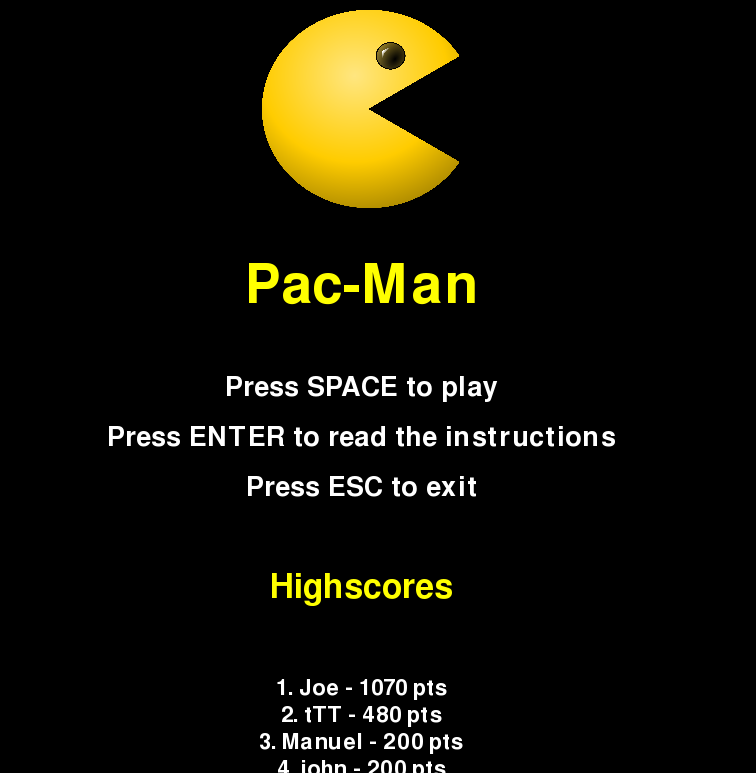
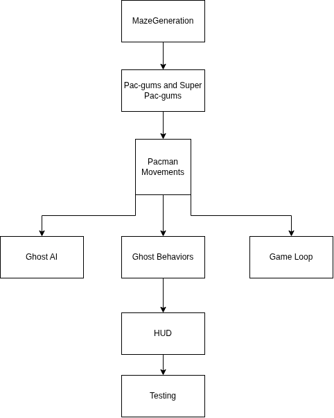
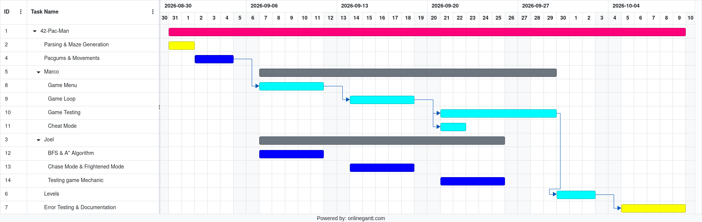

# 42-Pac-Man – Ghosts! More Ghosts!

## Table of Contents

- [Description](#description)
- [Instructions](#instructions)
- [Configuration](#configuration)
- [High Scores](#high-scores)
- [Maze Generation](#maze-generation)
- [Implementation](#implementation)
- [General Software Architecture](#general-software-architecture)
  - [Ghost AI](#ghost-ai)
  - [Maze Generation Details](#maze-generation-details)
  - [Pac-Man](#pac-man)
  - [Game Menu](#game-menu)
- [Project Management](#project-management)
- [Resources](#resources)

---

## Description

This project is an implementation of the classic Pac-Man game, originally released in 1980 and created by Tōru Iwatani. It was developed in Python as part of the 42 curriculum.

As in the original game, the player's progress is based on their score and advancement through levels. We also implemented a cheat mode that allows us to test the game's functionality without having to play the game as intended!

## Instructions

Python 3.10 or later is required to run this project.

Running `make` will install the required dependencies and launch the game. If the dependencies are already installed, you can simply run the following command to start the game:

```bash
python3 main.py config.json
```

Once the game has started, you will be greeted by the main screen, as shown below:



From the main menu, you can:

- Press **SPACE** to start the game.
- Press **ENTER** to view the instructions.
- View the top 10 highest scores.

The game also includes a cheat mode for testing purposes. To enable it, open the Instructions menu and type the word `cheat`. If cheat mode has been activated successfully, a message will appear stating **"Cheat mode ACTIVE"**.

## Configuration

The game's configuration settings are defined in the `config.json` file. This file contains the following options:

- `h_score` – Specifies the path where high-score data is stored. This file is read to display the top 10 scores and updated whenever a new score is saved.
- `lives` – Specifies the number of lives available per game. The default value is 3.
- `pacgum` – Sets the number of Pac-Gums placed in the maze.
- `points_per_pacgum` – Sets the number of points awarded for collecting a regular Pac-Gum.
- `points_per_super_pacgum` – Sets the number of points awarded for collecting a Super Pac-Gum.
- `points_per_ghost` – Sets the number of points awarded for eating a ghost.
- `seed` – Sets the random seed used to generate the maze for level 1. The default seed is 42.
- `level_max_time` – Sets the time limit for each level.
- `level` – Defines the width and height of the maze for each level. Ten levels are defined, with decreasing maze sizes as the player progresses.

## High Scores

To preserve each player's score after a game ends, the player can enter their name to be saved alongside the score they achieved during that run.

This functionality is handled by the `save_score` function in `game_menu.py`. The scores are stored in `./data/score.json`.

When the game starts, the `load_highscores` function reads `score.json`, retrieves the saved scores, and returns the 10 highest scores to be displayed on the screen.

## Maze Generation

The maze generator used in this project is provided as an installable package based on the *A-Maze-ing* project developed by other students. We installed the package using `pip` and imported it into our project.

The maze generator is used to create the maze for each level. The first level uses a fixed seed of 42, ensuring that the same maze is generated every time. The remaining levels use randomly generated mazes.

Each level has a smaller maze than the previous one, increasing the difficulty as the player progresses.

## Implementation

To recreate Pac-Man, we started by playing the original game to understand its mechanics and determine how best to reproduce the experience.

Since the maze generator was already provided, we initially focused on generating the maze, placing regular and Super Pac-Gums, and implementing Pac-Man's movement within the maze.

Once maze generation, Pac-Gum placement, and Pac-Man's movement were working correctly, we moved on to implementing the ghost AI and its different movement behaviors.

The ghost AI primarily uses two pathfinding algorithms: **A\*** and **Breadth-First Search (BFS)**. The ghosts use these algorithms to navigate the maze according to their current behavior, such as Chase or Scatter mode.

We also created a `Configuration` class to handle parsing the `config.json` file and managing the game's configuration settings.

## General Software Architecture

We decided to structure the project by developing the game engine first and then building the user interface around it.

Our workflow was as follows:



### Ghost AI

There are four ghosts in total, and each ghost has three behaviors defined in the `Ghost` class:

- **Frightened** – Activated when Pac-Man eats a Super Pac-Gum. The ghosts attempt to flee from Pac-Man.
- **Scatter** – The ghosts move between the corners of the maze, exploring their assigned areas.
- **Chase** – The ghosts pursue Pac-Man when he comes within a distance of seven cells, unless they are in Frightened mode.

In Scatter mode, the ghosts move from one corner of the maze to another. They use the A* algorithm to determine a path between their current position and their target corner.

When Pac-Man eats a Super Pac-Gum, the ghosts enter Frightened mode. They attempt to escape by selecting a cell farther away from Pac-Man and moving towards it.

In Chase mode, the ghosts pursue Pac-Man when he is within seven cells of them. However, Frightened mode takes priority, so the ghosts will continue fleeing while it is active.

### Maze Generation Details

As previously mentioned, the maze generator is provided as an installable package and is responsible for generating the mazes used throughout the game.

Only the first level uses the fixed seed `42`, which ensures that its maze remains the same between runs. The remaining levels use randomly generated mazes.

### Pac-Man

The `Pacman` class is defined in `movements.py`. It handles Pac-Man's movement within the maze, ensuring that he cannot pass through walls and that his movement responds to keyboard input.

### Game Menu

The game's menu system is implemented through several functions in `game_menu.py`. These functions display the main menu, the instructions menu, and the top 10 high scores.

The menu functions also handle user input, allowing players to navigate the menus, start the game, view the high scores, and activate cheat mode from the Instructions menu.

## Project Management

The following image shows the actual time spent developing this project, along with the distribution of tasks.



## Resources

- [Python Documentation](https://docs.python.org/3/)
- [Pygame Documentation](https://www.pygame.org/docs/)
- The original Pac-Man game, released in 1980 and created by Tōru Iwatani.
- The *A-Maze-ing* project, on which the provided maze generator package is based.
- [Diagram Creation](https://app.diagrams.net/ )
- [Gantt Chart Creation](https://www.onlinegantt.com/#/gantt)
- Chatgpt used for debugging code, proof reading the readme.